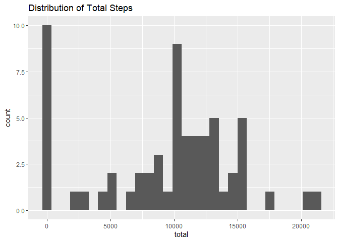
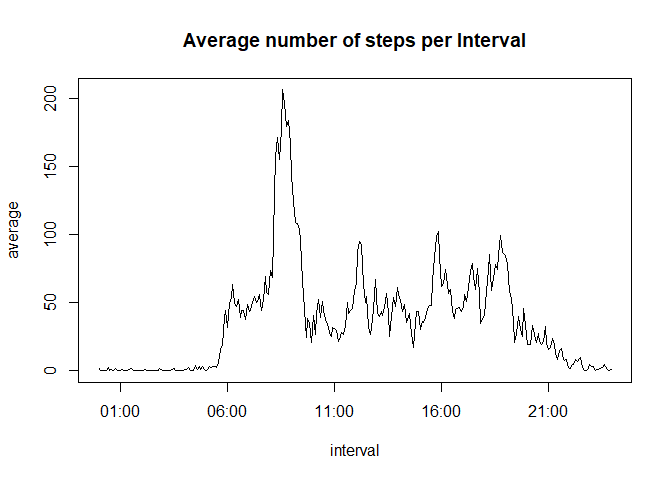
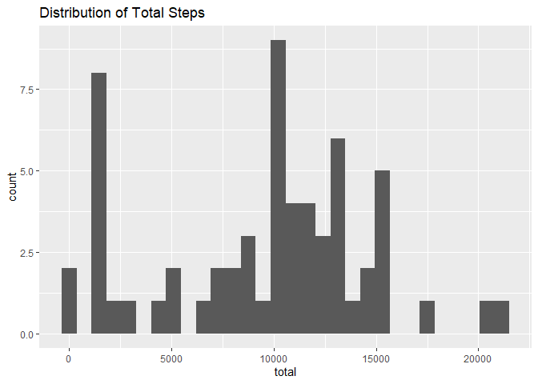
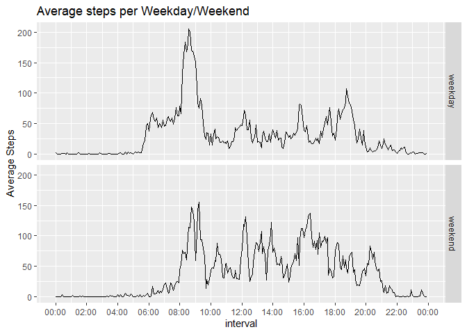

## Loading Libraries

```r
library(dplyr)
```

```
## 
## Attaching package: 'dplyr'
```

```
## The following objects are masked from 'package:stats':
## 
##     filter, lag
```

```
## The following objects are masked from 'package:base':
## 
##     intersect, setdiff, setequal, union
```

```r
library(ggplot2)
```

```
## Warning: package 'ggplot2' was built under R version 4.2.3
```

```r
library(scales)
```

```
## Warning: package 'scales' was built under R version 4.2.3
```
## Loading and preprocessing the data

```r
unzip("activity.zip")
activity <- read.csv("activity.csv")
activity$date <- as.Date(activity$date)


#Filling out the interval to turn it into %H:%M:%S
activity$interval <- sprintf("%04d", activity$interval)
activity$interval <- strptime(activity$interval, format = "%H%M")
```
## What is mean total number of steps taken per day?

```r
Summed <- activity %>%
  group_by(date) %>%
  summarise(total = sum(steps, na.rm = TRUE))
ggplot(Summed, aes(x = total)) + geom_histogram() + ggtitle("Distribution of Total Steps")
```

```
## `stat_bin()` using `bins = 30`. Pick better value with `binwidth`.
```

<!-- -->

```r
meanSteps <- (mean(Summed$total, na.rm= TRUE))
medianSteps <- (median(Summed$total, na.rm= TRUE))
Finaltable<- matrix(c("meansteps", "mediansteps", meanSteps, medianSteps), nrow = 2 , ncol = 2)
print(Finaltable)
```

```
##      [,1]          [,2]              
## [1,] "meansteps"   "9354.22950819672"
## [2,] "mediansteps" "10395"
```

## What is the average daily activity pattern?

```r
AveragedSteps <- activity %>%
  group_by(interval) %>%
  summarise(average = mean(steps, na.rm = TRUE))
with(AveragedSteps, plot(interval, average, type = "l", main = "Average number of steps per Interval"))
```

<!-- -->

```r
#To Calculate the max interval
maxsteps<-(AveragedSteps[which.max(AveragedSteps$average),])
#POSIxlt prints weird values, so formatting it back to normal characters
maxsteps$interval <- format(maxsteps$interval, format = "%H:%M:%S")
print(maxsteps)
```

```
## # A tibble: 1 × 2
##   interval average
##   <chr>      <dbl>
## 1 08:35:00    206.
```


## Imputing missing values

```r
#First calculating the number of missing values
print(sum(is.na(activity$steps)))
```

```
## [1] 2304
```

```r
#Imputing Variables: Choosing to go for the Median of intervals. Intervals more likely describe the average activity the person does at a given time.
activityFull <- as.data.frame(activity)
#Mediansteps by Interval
mediansteps <- activity %>%
  group_by(interval) %>%
  summarise(median = median(steps, na.rm = TRUE))
#Finding the missing indices, matching relevant interval
mediansteps <- as.data.frame(mediansteps)
activityFull <- merge(activityFull, mediansteps, by = "interval")
#Calculate Empty na indices
ind <- which(is.na(activityFull$steps))
activityFull$steps[ind] <- activityFull$median[ind]
activityFull <- activityFull[,-4]
#Reodering Data
activityFull <- activityFull %>%
  arrange(date,interval)

Summed2 <- activityFull %>%
  group_by(date) %>%
  summarise(total = sum(steps))
ggplot(Summed2, aes(x = total)) + geom_histogram() + ggtitle("Distribution of Total Steps")
```

```
## `stat_bin()` using `bins = 30`. Pick better value with `binwidth`.
```

<!-- -->

```r
meanSteps2 <- (mean(Summed2$total))
medianSteps2 <- (median(Summed2$total))
Finaltable2<- matrix(c("meansteps", "mediansteps", meanSteps2, medianSteps2), nrow = 2 , ncol = 2)
print(Finaltable2)
```

```
##      [,1]          [,2]              
## [1,] "meansteps"   "9503.86885245902"
## [2,] "mediansteps" "10395"
```
###The median has remained the same, but the average has been lowered.


## Are there differences in activity patterns between weekdays and weekends?

```r
CurrentLocale <- Sys.getlocale("LC_TIME")
#Setting locale to english for readabiliy
Sys.setlocale("LC_TIME", "en_US")
```

```
## [1] "en_US"
```

```r
summedWeek <- activityFull %>%
  mutate(weekday = weekdays(date, abbreviate= TRUE))%>%
  mutate(weekdays = ifelse(weekday == "Sat" | weekday == "Sun", "weekend", "weekday"))%>%
  select(-weekday)%>%
  mutate(weekdays = as.factor(weekdays))%>%
  group_by(interval,weekdays)%>%
  summarise(average = mean(steps))
```

```
## `summarise()` has grouped output by 'interval'. You can override using the
## `.groups` argument.
```

```r
Sys.setlocale("LC_TIME", CurrentLocale)
```

```
## [1] "Dutch_Netherlands.utf8"
```

```r
summedWeek$interval <- as.POSIXct(summedWeek$interval)

ggplot(summedWeek, aes(x = interval, y = average))+ geom_line()+scale_x_datetime(breaks = "2 hours", date_labels = "%H:%M")+facet_grid(rows=vars(summedWeek$weekdays)) + labs(title = "Average steps per Weekday/Weekend", y = "Average Steps")
```

<!-- -->
